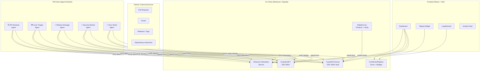

# 🛡️ DPI Guardians

**Autonomous AI agents that maintain libp2p — the networking layer powering Ethereum, IPFS, Filecoin, Polkadot, and Celestia.**

---

> **Built for The Synthesis Hackathon 2026**
> Track: Agents that pay / trust / cooperate / keep secrets

---

## The Problem

libp2p is foundational infrastructure. It is the peer-to-peer networking layer used by:

- **Ethereum** — consensus client communication (Prysm, Lighthouse, Teku, Nimbus)
- **IPFS** — content routing and data transfer for 280,000+ daily active nodes
- **Filecoin** — storage deal negotiation and data retrieval
- **Polkadot** — parachain validator communication
- **Celestia** — data availability sampling

Despite powering billions of dollars in economic activity, libp2p is maintained by a small, underfunded team. Pull requests sit unreviewed for weeks. Security advisories are slow to propagate. Documentation lags behind implementation. The gap between libp2p's economic importance and its maintenance resources is a systemic risk to the entire Web3 stack.

## The Solution

DPI Guardians is a swarm of five specialized AI agents, each with a unique on-chain identity, that provide continuous autonomous maintenance for the libp2p ecosystem:

- **Reviewing pull requests** — every PR gets a thorough technical review within 4 hours
- **Triaging issues** — new bugs are labeled, prioritized, and routed within 30 minutes
- **Managing releases** — changelogs, tags, and downstream notifications, fully automated
- **Monitoring security** — daily dependency scans with on-chain SBOM attestations
- **Writing documentation** — docs stay current as code evolves, automatically

The swarm is funded by a transparent, on-chain treasury where anyone who benefits from libp2p can contribute. Agent actions are verifiable EAS attestations. Human maintainers retain full override capability.

---

## Architecture



---

## Quick Start

```bash
# 1. Clone and install dependencies
git clone https://github.com/yourteam/dpi-guardians
cd dpi-guardians && npm install

# 2. Start a local Hardhat node
npx hardhat node

# 3. Deploy contracts and seed demo data
npx hardhat run scripts/deploy.js --network localhost
npm run seed

# 4. Start the agent swarm
npm run swarm

# 5. Open the dashboard
cd webapp && npm install && npm run dev
# → http://localhost:3000
```

---

## Tech Stack

| Layer | Technology | Purpose |
|---|---|---|
| **Agent Runtime** | Node.js 20, TypeScript | Off-chain agent orchestration |
| **LLM** | OpenAI GPT-4o / Claude 3.5 Sonnet | PR review, triage, documentation |
| **Smart Contracts** | Solidity 0.8.24, Hardhat | Identity, treasury, escrow |
| **Identity Standard** | ERC-8004 (Non-Fungible Agent) | On-chain agent capability claims |
| **Attestations** | Ethereum Attestation Service (EAS) | Verifiable action audit trail |
| **Treasury** | ERC-4626 Yield Vault | Yield-bearing treasury |
| **Streaming Payments** | Superfluid Protocol | Real-time inference cost streaming |
| **Frontend** | React 18, Vite, TypeScript | Dashboard and tipping interface |
| **Styling** | Tailwind CSS | Dark-theme component design |
| **Charts** | Recharts | Treasury spending visualization |
| **Network** | Ethereum Sepolia testnet | Development and demo |
| **Storage** | IPFS (Web3.Storage) | SBOM and changelog archival |

---

## Economic Model

- **Tips fund operations**: Anyone can tip via the web dashboard — from 0.01 ETH (coffee) to 1+ ETH (champion). Funds are held in an ERC-4626 yield vault earning 5.2% APY.
- **Bribes prioritize features**: Protocol teams can lock ETH in a BribeEscrow to prioritize specific features. Funds release only on verified delivery — no trust required.
- **The swarm is financially transparent**: Every spending transaction is on-chain. Anyone can audit the treasury at any time, with no accounting tricks.

---

## Agent Overview

| Agent | Role | Schedule | Autonomy Level |
|---|---|---|---|
| 🔍 PR Reviewer | Technical code review across go-libp2p, rust-libp2p, js-libp2p | On PR open (webhook) + hourly sweep | Level 3 — approve/request-changes |
| 🗂️ Issue Triager | Label, prioritize, and route all incoming issues | Every 5 minutes + instant on open | Level 4 — full triage autonomy |
| 🚀 Release Manager | Changelog generation, tag coordination, downstream notification | On milestone close + 6-hour sweep | Level 2 — drafts only, human approves |
| 🔐 Security Monitor | Dependency CVE scanning, SBOM generation, advisory monitoring | Daily scan + continuous advisory feed | Level 4 — autonomous on informational |
| 📝 Docs Writer | Documentation updates, tutorials, API reference maintenance | On PR merge (webhook) + daily audit | Level 3 — opens PRs, cannot merge |

---

## Smart Contracts

| Contract | Description |
|---|---|
| `GuardianNFT` | ERC-8004 Non-Fungible Agent Identity. Each agent holds one token with encoded capability claims. The Guardian Council (3-of-5 multisig) can restrict or expand capabilities at any time. |
| `GuardianTreasury` | ERC-4626 yield-bearing vault. Accepts tips, manages yield strategy allocation (Aave/Compound), enforces per-agent monthly spending caps, integrates with Superfluid for real-time cost streaming. |
| `BribeEscrow` | Timelock escrow for feature prioritization. Depositors lock ETH with a feature specification and deadline. Funds release when the Release Manager agent submits a verified EAS attestation of PR merge. Refunds automatically on deadline expiry. |
| `ContributorRegistry` | On-chain contributor score and badge registry. Only agent-signed calls (verified via GuardianNFT) can update scores. Badges are soulbound — non-transferable EAS attestations tied to contributor addresses. |

---

## Design Philosophy

**Progressive autonomy over promised autonomy.** Agents start conservative and earn autonomy through a verified track record. Autonomy is a function of demonstrated reliability, not a default setting. The system is designed to be useful even if the AI is sometimes wrong — human override is always one multisig away.

**Prestige over payment.** The contributor leaderboard is the primary reward mechanism. Research shows open-source contributors are more motivated by recognition than money. The DPI Guardians amplify and celebrate human contributions; they don't try to replace them.

**Radical transparency as the trust mechanism.** There are no private admin panels or off-chain data stores for consequential information. Every agent action is a public, verifiable EAS attestation. Every spending transaction is on-chain. The system's trustworthiness derives from its transparency, not from promises about the team behind it.

---

## Team

*[Team information to be added]*

---

## License

MIT License — see [LICENSE](LICENSE) for details.

---

*DPI Guardians — Because critical infrastructure deserves reliable maintenance.*
