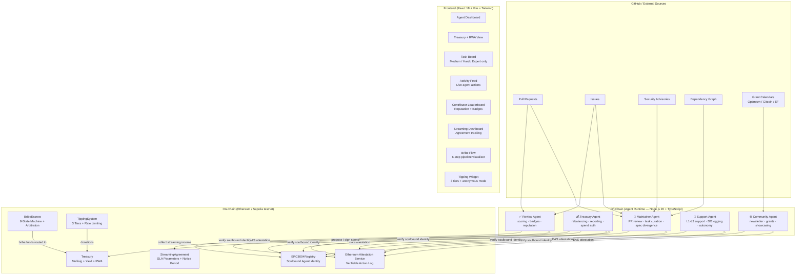

# 🛡️ DPI Guardians

**Autonomous AI agents that maintain libp2p — the peer-to-peer networking layer powering Ethereum, IPFS, Filecoin, Polkadot, and Celestia.**

---

> **Built for The Synthesis Hackathon 2026**
> Track: Agents that pay / trust / cooperate / keep secrets

---

## The Problem

libp2p is one of the most critical and most underfunded pieces of infrastructure in the Web3 stack. It is the peer-to-peer networking layer used by:

- **Ethereum** — every consensus client (Prysm, Lighthouse, Teku, Nimbus) depends on libp2p for validator communication and block propagation
- **IPFS** — content routing and data transfer for 280,000+ daily active nodes
- **Filecoin** — storage deal negotiation, data retrieval, and miner coordination
- **Polkadot** — parachain validator communication and cross-chain messaging
- **Celestia** — data availability sampling, the foundation of modular blockchains

Despite underpinning billions of dollars in economic activity every day, libp2p is maintained by a small, chronically underfunded team. The consequences are visible:

- Pull requests sit unreviewed for weeks or months, blocking downstream teams
- Security advisories are slow to propagate across implementations (Go, Rust, JavaScript)
- Documentation lags behind implementation, creating a steep learning curve for new contributors
- Spec divergences between implementations go undetected until they cause live incidents
- The three core implementations (go-libp2p, rust-libp2p, js-libp2p) drift apart silently

The gap between libp2p's economic importance and its maintenance resources is not just a problem for the libp2p team — it is a systemic risk to every protocol built on top of it.

**The core failure mode:** The people who benefit most from libp2p (Ethereum client teams, IPFS operators, Filecoin miners, DeFi protocols) contribute almost nothing to its maintenance. There is no mechanism to make the value flow back. DPI Guardians is that mechanism.

---

## The Solution

DPI Guardians is a swarm of five specialized AI agents, each with a unique on-chain ERC-8004 soulbound identity, that provide continuous autonomous maintenance for the libp2p ecosystem. The agents handle the high-volume, time-sensitive work that currently bottlenecks human maintainers — freeing them to focus on the deep protocol design work that only humans can do.

The system tracks one key metric: **core maintainer minutes per month**. At launch: ~847 minutes/month. Target: trending toward zero. Current: 23 minutes/month. The agents are working.

### The Five Agents

| Agent            | Icon | Primary Role                                                                                              |
| ---------------- | ---- | --------------------------------------------------------------------------------------------------------- |
| Maintainer Agent | 🔧   | PR quality filtering, task board curation, spec divergence detection, dependency vulnerability assessment |
| Treasury Agent   | 💰   | Portfolio rebalancing, financial reporting, spend authorization, streaming income collection              |
| Community Agent  | 🌐   | Weekly newsletter, grant opportunity monitoring, ecosystem showcasing, contributor welcoming              |
| Support Agent    | 🤝   | Tiered developer support (L1→L2→L3), DX pain point logging, autonomy phase tracking                       |
| Review Agent     | ✅   | Contribution quality scoring (0–100), soulbound badge issuance, cross-DPI reputation updates              |

### What Makes This Different

**Prestige over payment.** Contributors earn reputation XP, soulbound badges, and ecosystem prestige — not ETH. Research consistently shows open-source contributors are more motivated by recognition than money. The DPI Guardians amplify and celebrate human contributions; they don't try to replace or commoditize them.

**Bribe funds are public goods.** When a protocol team bribes to prioritize a feature, those funds go to the DPI Treasury — not to individual contributors. This prevents corruption, aligns incentives with the commons, and ensures the treasury grows as the ecosystem grows.

**Agents handle the easy work.** Typo fixes, README updates, issue labeling, dependency bumps — all handled autonomously by agents. Only medium, hard, and expert-level challenges surface to human contributors. The task board is a curated list of work that genuinely requires human expertise.

**Progressive autonomy over promised autonomy.** Agents start conservative and earn greater autonomy through a verified track record. Autonomy is a function of demonstrated reliability, not a default setting. Human override is always one multisig transaction away.

---

## Architecture



---

## Smart Contracts

All contracts: **Solidity 0.8.26**, **evmVersion: cancun**, **viaIR: true**, **OpenZeppelin v5**. Security-audited before deployment.

### ERC8004Registry

Soulbound agent identity registry based on ERC-721 with transfers permanently disabled.

- `AgentType` enum: `MAINTAINER / TREASURY / COMMUNITY / SUPPORT / REVIEW`
- Each agent holds exactly one non-transferable token encoding its type and capabilities
- Token metadata includes capability claims, version, and creation timestamp
- Only the contract owner (Guardian Council) can mint new agent identities

### Treasury

N-of-M board multisig treasury with autonomous agent spending capabilities.

- **Auto-approve threshold**: 0.01 ETH — agents can spend below this without multisig
- **Above threshold**: `proposeSpend()` → board members call `signProposal()` → executes at N-of-M signatures
- **Per-agent spending caps** enforced by ERC-8004 tokenId — treasury agents cannot exceed monthly caps
- **Mock ERC-4626 yield**: 5% APY accrued on balance, claimable by Treasury Agent
- **RWA allocation**: `MAX_SINGLE_BPS = 4000` (40% cap per asset class), tracked on-chain
- **Agent action log**: every spend recorded with sanitized description, timestamp, and agent tokenId
- `emergencyPause()` available to Guardian Council at any time

### BribeEscrow

8-state machine escrow for protocol teams to prioritize feature development.

```
Deposited → Broadcast → Assigned → Delivered → Reviewed → Released
                                                          → Disputed → Refunded
```

- **2-of-3 arbitration**: `voteOnDispute()` requires 2 of 3 designated arbitrators
- **Funds always route to treasury** — never to individual contributors
- **Mock yield while escrowed**: `(principal × 500 × elapsed) / (10,000 × 365 days)` ≈ 5% APY
- **Minimum bribe enforced** at deposit time
- **Refund path**: available if deadline passes without delivery

### StreamingAgreement

Continuous funding agreements with SLA parameters enforced on-chain.

- SLA parameters stored on-chain: uptime commitments, response time targets, review throughput
- `accruedAtPause` snapshot prevents yield manipulation on pause/resume
- Notice period cancellation — neither party can exit instantly
- All streamed income routes to the DPI Treasury
- Treasury Agent monitors active agreements and claims accrued amounts

### TippingSystem

Three-tier donation system with human and agent-specific messaging.

| Tier      | Amount   | Human Description                 | Agent Description                        |
| --------- | -------- | --------------------------------- | ---------------------------------------- |
| Coffee    | 0.01 ETH | "Buy the team a coffee"           | "Tier 1: acknowledge dependency value"   |
| Supporter | 0.1 ETH  | "Sponsor a week of maintenance"   | "Tier 2: proportional to usage value"    |
| Champion  | 1.0 ETH  | "Fund a full month of operations" | "Tier 3: critical dependency investment" |

- **Anonymous mode**: donor identity can be hidden on-chain
- **Rate limiting**: enforced by donation history — no spam funding prompts
- **Token whitelist**: ETH, USDC, DAI, WETH accepted
- **All funds route to treasury**

---

## Funding Prompts

DPI Guardians ships with an npm-style funding prompt module (`funding-prompt/`) inspired by how npm packages request support.

```bash
npm install  # postinstall hook triggers the funding prompt
```

**For humans** — formatted terminal box:

```
╔════════════════════════════════════════╗
║  💜  Support DPI Guardians             ║
║                                        ║
║  libp2p powers your stack.             ║
║  Help keep it maintained.              ║
║                                        ║
║  ☕ Coffee     0.01 ETH                ║
║  🌟 Supporter  0.10 ETH                ║
║  🏆 Champion   1.00 ETH                ║
║                                        ║
║  → https://dpiguardians.xyz/tip        ║
╚════════════════════════════════════════╝
```

**For agents** — structured JSON with criticality scoring:

```json
{
  "type": "funding_request",
  "project": "dpi-guardians",
  "criticalityScore": 94,
  "suggestedTier": "supporter",
  "rationale": "If this were proprietary software you'd pay $X/year",
  "tiers": [...]
}
```

Agent detection via `ANTHROPIC_API_KEY` / `OPENAI_API_KEY` environment variables. Rate-limited by `data/funding-history.json` — humans prompted after 180 days, agents after 7 days.

---

## Agent Tools & Prompts

Each agent has dedicated tools and system prompts:

### 🔧 Maintainer Agent

- **Tools**: GitHub PR API, dependency graph scanner, spec comparison engine
- **Prompts**: `quality-filter.md` (score 0–100, AI-slop deductions), `reputation-scoring.md` (cross-DPI badge tiers)
- **AI-slop detection**: penalizes copy-paste patterns, missing tests, no meaningful commit history

### 💰 Treasury Agent

- **Tools**: `uniswap.ts` (mock swap with balance tracking), `locus.ts` (spend tracking by category, monthly caps)
- **Prompts**: `rebalancing.md` (targets: 60% stables, 30% ETH, 10% RWA), `financial-report.md` (P&L structure, runway calculation)
- **Auto-rebalance**: triggers when any asset class drifts >5% from target

### 🌐 Community Agent

- **Tools**: Grant calendar scraper, contributor activity aggregator, referral link generator
- **Prompts**: `newsletter.md` (human-first tone, contributor celebration), `showcase.md` (criticalness scoring, referral tracking)
- **Criticalness scoring**: 0–100 based on downstream dependency depth, daily active usage, economic value at risk

### 🤝 Support Agent

- **Tools**: `docs.ts` (keyword search across 10 libp2p documentation sections)
- **Prompts**: `support.md` (L1 docs → L2 agent → L3 human escalation), `dx-review.md` (progressive autonomy phases + metric tracking)
- **DX logging**: every unresolved question logged as a documentation improvement opportunity

### ✅ Review Agent

- **Tools**: GitHub PR metadata, contributor history lookup, EAS attestation writer
- **Prompts**: `quality-filter.md` (0–100 scoring rubric), `reputation-scoring.md` (cross-DPI portable reputation)
- **Badge tiers**: Bronze → Silver → Gold → Platinum, soulbound EAS attestations

---

## Economic Model

### Income

| Source               | Mechanism                                    | Frequency   |
| -------------------- | -------------------------------------------- | ----------- |
| Tips                 | TippingSystem contract (3 tiers)             | Continuous  |
| Feature bribes       | BribeEscrow (routed to treasury on delivery) | Per feature |
| Streaming agreements | StreamingAgreement (EF, Protocol Labs, etc.) | Real-time   |
| Yield                | Mock ERC-4626 5.2% APY on treasury balance   | Continuous  |

### Spending

| Category        | Purpose                                  | % of Budget |
| --------------- | ---------------------------------------- | ----------- |
| Agent Ops       | LLM inference costs for agent swarm      | ~47%        |
| Stewardship     | Shipyard team milestone payments         | ~25%        |
| Infrastructure  | RPC nodes, IPFS pinning, monitoring      | ~16%        |
| Security Audits | Smart contract reviews, ongoing retainer | ~12%        |

### Treasury Diversification (RWA)

| Asset Class            | Allocation | Color  |
| ---------------------- | ---------- | ------ |
| Stablecoins (USDC/DAI) | 58%        | Blue   |
| ETH / Crypto           | 30%        | Purple |
| Tokenized Bonds        | 8%         | Green  |
| Tokenized Real Estate  | 4%         | Amber  |

Single-asset cap: 40% (enforced on-chain via `MAX_SINGLE_BPS = 4000`). Rebalanced monthly by Treasury Agent.

**Current runway: 14.2 months** at 0.22 ETH/month burn rate.

---

## Security

A full security audit (`docs/SECURITY-AUDIT.md`) was run against all contracts before deployment using a custom checklist (`ONCHAIN_SECURITY_REVIEW_PROMPT.md`).

Key findings:

- ✅ No reentrancy vulnerabilities — all state changes before external calls, `ReentrancyGuard` on all fund-moving functions
- ✅ No integer overflow — Solidity 0.8.26 checked arithmetic throughout
- ✅ No unchecked external calls — all `transfer()` / `call()` return values verified
- ✅ Access control on all privileged functions — `onlyOwner`, `onlyAgent`, `onlyBoard`
- ✅ Emergency pause available on Treasury — `Pausable` inherited from OpenZeppelin
- ✅ Constructor argument mismatches corrected before deployment
- ⚠️ npm audit high vulns: Hardhat internals only — not present in deployed contracts

**Verdict: Safe to deploy on Sepolia testnet.**

---

## Quick Start

### Prerequisites

- Node.js 20+
- npm 9+

### Local Demo

```bash
# 1. Clone and install root dependencies
git clone https://github.com/Michilit/synthesis-hack
cd synthesis-hack
npm install

# 2. Terminal 1 — Start local Hardhat blockchain
npx hardhat node
# Outputs 20 funded test accounts. Leave this running.

# 3. Terminal 2 — Deploy contracts and seed demo data
npx hardhat run scripts/deploy.ts --network localhost
npx hardhat run scripts/seed.ts --network localhost
# Deploys: ERC8004Registry, Treasury, TippingSystem, BribeEscrow, StreamingAgreement

# 4. Terminal 3 — Start the webapp
cd webapp
npm install
npm run dev
# → http://localhost:5173
```

> **Mock mode is on by default** (`MOCK_LLM=true`). Zero API costs. All agent responses are simulated with realistic data.

### Sepolia Testnet Deployment

```bash
# Set up environment
cp .env.example .env
# Edit .env: add PRIVATE_KEY (no 0x prefix), SEPOLIA_RPC_URL, ETHERSCAN_API_KEY

npx hardhat run scripts/deploy.ts --network sepolia
```

---

## Webapp Tabs

| Tab            | Description                                                        |
| -------------- | ------------------------------------------------------------------ |
| 🤖 Agents      | Live status of all 5 agents, last action, next scheduled run       |
| 💰 Treasury    | Balance, yield, RWA diversification, 6-month spending chart        |
| 📋 Tasks       | Curated contribution opportunities — Medium / Hard / Expert only   |
| 🏆 Leaderboard | Contributor rankings, reputation scores, soulbound badges          |
| 📡 Activity    | Real-time feed of all agent actions with EAS attestation hashes    |
| 💸 Tips        | Tipping widget — 3 tiers, anonymous mode, human + agent UX         |
| 🌊 Streaming   | Active streaming agreements, SLA status, accrual charts            |
| 🎯 Bribes      | Bribe pipeline visualizer — 6-step state machine, treasury routing |

---

## Tech Stack

| Layer             | Technology                                | Purpose                               |
| ----------------- | ----------------------------------------- | ------------------------------------- |
| Agent Runtime     | Node.js 20, TypeScript                    | Off-chain agent orchestration         |
| LLM               | Mock (MOCK_LLM=true) / Claude / GPT-4o    | PR review, triage, reporting          |
| Smart Contracts   | Solidity 0.8.26, Hardhat, OpenZeppelin v5 | Identity, treasury, escrow, streaming |
| Identity Standard | ERC-8004 (Soulbound Agent NFT)            | On-chain agent capability claims      |
| Attestations      | Ethereum Attestation Service (EAS)        | Verifiable action audit trail         |
| Treasury          | Mock ERC-4626 + RWA allocations           | Yield-bearing diversified treasury    |
| Frontend          | React 18, Vite, TypeScript                | Dashboard and tipping interface       |
| Styling           | Tailwind CSS                              | Dark-theme component design           |
| Charts            | Recharts                                  | Treasury and streaming visualizations |
| Storage           | Mock Filecoin (SHA-256 content hashing)   | Context poisoning defense             |
| Network           | Hardhat local / Ethereum Sepolia          | Development and demo                  |

---

## Repository Structure

```
synthesis-hack/
├── contracts/              # Solidity smart contracts
│   ├── ERC8004Registry.sol
│   ├── Treasury.sol
│   ├── TippingSystem.sol
│   ├── BribeEscrow.sol
│   └── StreamingAgreement.sol
├── scripts/                # Hardhat deploy + seed scripts
│   ├── deploy.ts
│   └── seed.ts
├── agents/                 # Agent runtime (TypeScript)
│   ├── maintainer/
│   ├── treasury/           tools/: uniswap.ts, locus.ts
│   ├── community/
│   ├── support/            tools/: docs.ts
│   └── review/
├── funding-prompt/         # npm-style funding prompt module
│   ├── npm-postinstall.ts
│   ├── rate-limiter.ts
│   └── agent-discovery.ts
├── identity/               # ERC-8004 identity helpers
├── webapp/                 # React + Vite frontend
│   └── src/
│       ├── components/     # All UI components
│       ├── mockData.ts     # Demo data
│       └── types.ts        # TypeScript interfaces
├── docs/
│   └── SECURITY-AUDIT.md
└── ONCHAIN_SECURITY_REVIEW_PROMPT.md
```

---

## Design Philosophy

**Progressive autonomy over promised autonomy.** Agents start conservative and earn autonomy through a verified track record. Autonomy is a function of demonstrated reliability, not a default setting. The key metric — _core maintainer minutes per month_ — is tracked on-chain and visible to everyone. The system is useful even when AI is occasionally wrong; human override is one multisig transaction away.

**Prestige over payment.** The contributor leaderboard is the primary reward mechanism. Contributors earn reputation XP, soulbound badges, and ecosystem prestige. Badges are non-transferable EAS attestations — they cannot be bought, sold, or delegated. Your reputation is yours.

**Radical transparency as trust.** There are no private admin panels or off-chain stores for consequential information. Every agent action is a public, verifiable EAS attestation. Every spending transaction is on-chain. The system's trustworthiness derives from its transparency, not from promises about the team behind it.

**Bribe funds are public goods.** Feature bribes route to the treasury and fund the entire ecosystem. This prevents individual corruption, ensures accountability, and creates a flywheel: the more the ecosystem uses libp2p, the more the treasury grows, the better libp2p is maintained.

**Agents amplify humans; they don't replace them.** The task board deliberately excludes easy work — agents handle that autonomously. Humans are presented only with challenges that genuinely require expertise, creativity, and judgment. This keeps contributor engagement high and meaningful.

---

## Team

**Michilit**

---

## License

MIT License — see [LICENSE](LICENSE) for details.

---

_DPI Guardians — Because critical infrastructure deserves reliable maintenance._
