# DPI Guardians — Architecture

## Executive Summary

DPI Guardians is a swarm of five specialized AI agents that provide autonomous maintenance for the libp2p protocol ecosystem. Each agent holds a unique on-chain identity via the ERC-8004 Non-Fungible Agent standard, enabling verifiable capability claims, immutable action logs via Ethereum Attestation Service, and transparent economic flows through a shared treasury. The system is designed around the principle of progressive autonomy — agents begin in suggest-only mode and earn increasing operational independence as they accumulate a verified, on-chain track record.

The architecture separates concerns cleanly: agent intelligence lives off-chain (LLM-powered, running as Node.js processes), while trust, accountability, and economics live on-chain (Solidity contracts on Ethereum/Sepolia). This hybrid design lets the system operate affordably at current inference costs while preserving the tamper-proof auditability that open-source ecosystems require. Human maintainers retain full override capability at all times through a Guardian Council multisig, ensuring the swarm is a force multiplier for human judgment — not a replacement for it.

---

## System Architecture Diagram

```mermaid
graph TB
    subgraph OFFCHAIN["Off-Chain (Agent Runtime)"]
        PR[🔍 PR Reviewer\nAgent]
        TR[🗂️ Issue Triager\nAgent]
        RM[🚀 Release Manager\nAgent]
        SM[🔐 Security Monitor\nAgent]
        DW[📝 Docs Writer\nAgent]
    end

    subgraph GITHUB["GitHub / External Sources"]
        GH_PR[Pull Requests]
        GH_IS[Issues]
        GH_REL[Releases / Tags]
        GH_DEP[Dependency Advisories]
    end

    subgraph ONCHAIN["On-Chain (Ethereum / Sepolia)"]
        NFT[GuardianNFT\nERC-8004]
        TREAS[GuardianTreasury\nERC-4626 Vault]
        ESCROW[BribeEscrow\nTimelock + Verify]
        CONTRIB[ContributorRegistry\nScore + Badges]
        EAS[Ethereum Attestation\nService]
    end

    subgraph STREAMING["Payment Layer"]
        SF[Superfluid\nReal-Time Streams]
        YIELD[Yield Strategies\nAave / Compound]
    end

    subgraph WEBAPP["Frontend (React + Vite)"]
        DASH[Dashboard\nDark Theme]
        TIP[Tipping Widget]
        BOARD[Contributor\nLeaderboard]
        FEED[Live Activity\nFeed]
    end

    PR -->|reads| GH_PR
    TR -->|reads/labels| GH_IS
    RM -->|monitors| GH_REL
    SM -->|scans| GH_DEP
    DW -->|reads merged PRs| GH_PR

    PR -->|EAS attestation| EAS
    TR -->|EAS attestation| EAS
    RM -->|EAS attestation| EAS
    SM -->|SBOM + attestation| EAS
    DW -->|EAS attestation| EAS

    PR & TR & RM & SM & DW -->|verify identity| NFT
    PR & TR & RM & SM & DW -->|spend from| TREAS

    TREAS -->|yield deposit| YIELD
    TREAS -->|stream costs| SF

    ESCROW -->|locked funds| TREAS
    CONTRIB -->|scores| EAS

    DASH --> NFT
    DASH --> TREAS
    DASH --> CONTRIB
    FEED --> EAS
    TIP --> TREAS
    BOARD --> CONTRIB
```

---

## Agent Responsibilities

| Agent | Primary Role | Cadence | Autonomy Level | Key Output |
|---|---|---|---|---|
| **PR Reviewer** | Reviews incoming pull requests across go-libp2p, rust-libp2p, and js-libp2p. Checks for security issues, code quality, test coverage, and protocol compliance. Assigns reviewers via CODEOWNERS. | On-demand (webhook) + hourly sweep | Level 3 — can approve, cannot merge alone | EAS attestation per PR review |
| **Issue Triager** | Labels, prioritizes, and routes incoming issues. Identifies duplicates, links cross-repo issues, closes stale reports, and surfaces high-priority bugs to maintainers. | Every 5 minutes | Level 4 — full triage autonomy | Labels, assignments, cross-repo links |
| **Release Manager** | Monitors milestone completion, drafts changelogs, creates release tags, and notifies downstream consumers (IPFS, Filecoin node teams). | On milestone completion + 6h sweep | Level 2 — drafts only, human approves tag | Changelog drafts, release notes |
| **Security Monitor** | Scans all dependency trees for CVEs, generates SBOMs, monitors security advisories, and publishes quarterly audit summaries. Alerts are on-chain attestations. | Daily full scan + continuous advisory watch | Level 4 — autonomous for informational; Level 1 for breaking changes | SBOM IPFS CIDs, EAS security attestations |
| **Docs Writer** | Tracks merged PRs with API changes, updates reference documentation, writes tutorials for new features, and ensures docs.libp2p.io stays current. | On PR merge (webhook) + daily audit | Level 3 — can open PRs, cannot merge | Documentation PRs, tutorial drafts |

---

## Smart Contract Relationships

The four deployed contracts form an interconnected system with clear separation of concerns:

**GuardianNFT (ERC-8004)** is the root of trust. Each agent holds one token, which encodes their capability claims as EIP-712 signed structs. The contract exposes `verifyClaim(tokenId, capability)` which agent runtime code calls before taking sensitive actions. The Guardian Council (3-of-5 multisig) can revoke or restrict capabilities without burning the token.

**GuardianTreasury (ERC-4626)** manages all economic flows. Tips are deposited directly; yield strategies (Aave, Compound) are pluggable via the vault interface. Monthly budget caps are enforced per-agent — each agent has a `monthlyBudget` mapping that resets on the 1st of each month. Superfluid integration streams operational costs in real time, so spending is granular rather than lumpy.

**BribeEscrow** implements a timelock with delivery verification. Depositors specify a feature (as a string hash), a deadline, and an optional verifier contract address. On delivery, the Release Manager agent calls `verify(escrowId, prMergeAttestation)` — if the EAS attestation checks out, funds release to the contributor who merged the PR. If the deadline passes without delivery, depositors can reclaim funds.

**ContributorRegistry** maintains contributor scores and badge assignments. Only agent addresses (verified via GuardianNFT) can call `updateScore()`. Scores are computed off-chain by the PR Reviewer agent and submitted as signed calldata — the contract verifies the signature against the agent's NFT token before accepting updates.

---

## Data Flow

### Tip Flow
1. User selects tier and amount in TippingWidget (React frontend)
2. Ethers.js signs and broadcasts transaction to `GuardianTreasury.deposit(amount, anonymous)`
3. Treasury contract accepts ETH, issues ERC-4626 vault shares to swarm
4. Contract emits `TipReceived(from, amount, message, anonymous)` event
5. Activity Feed agent (frontend) picks up event via `eth_getLogs` and displays in real-time
6. Monthly: yield accrues; `rebalance()` called by Release Manager to optimize strategy allocation

### Bribe Escrow Flow
1. Protocol stakeholder calls `BribeEscrow.deposit(featureDescription, deadline, amount)` with ETH value
2. Escrow contract creates new escrow record, emits `EscrowCreated` event
3. Issue Triager agent detects event, creates a high-priority issue in the relevant repo with escrow details
4. Human contributors see the bounty and begin working
5. When a qualifying PR is merged, Release Manager agent calls `BribeEscrow.release(escrowId, easAttestationUID)`
6. Contract verifies attestation via EAS resolver, releases funds to PR author's address

### PR Review Flow
1. GitHub webhook fires on new PR or review request
2. PR Reviewer agent fetches PR diff, description, and test results via GitHub API
3. Agent constructs review using LLM with repository context and CODEOWNERS data
4. Agent submits GitHub review (approve/request-changes/comment) via GitHub API
5. Agent creates EAS attestation: `{ agentTokenId, prUrl, decision, reasoning, confidenceScore }`
6. Attestation UID is logged to agent's action ledger; `actionsToday` counter incremented on-chain
7. ContributorRegistry scores are updated if the PR is eventually merged

### Security Advisory Flow
1. Security Monitor polls GitHub Advisory Database and OSV every 6 hours
2. On new advisory, agent cross-references all libp2p repo dependency trees
3. If affected: agent creates GitHub issue tagged `security`, pings maintainers, creates EAS attestation
4. SBOM is regenerated and new CID pinned to IPFS; CID stored on-chain in agent's action ledger
5. Monthly: agent drafts audit summary as a Markdown document, publishes CID to governance forum

---

## Trust Model

The DPI Guardians operate under an explicit layered trust model:

**Layer 0 — Human Override**: The Guardian Council (3-of-5 multisig of core libp2p maintainers) has unrestricted power to pause agents, revoke capabilities, drain the treasury to a safe address, and modify all contract parameters. This layer exists outside the autonomous system and cannot be overridden by agent actions.

**Layer 1 — Cryptographic Verification**: Agent identities are verified on-chain via ERC-8004 tokens before any state-changing action. An agent cannot spend treasury funds or update contributor scores without presenting a valid token signature.

**Layer 2 — Capability Claims**: Each agent token specifies exactly which operations the agent is authorized to perform (e.g., `CAN_REVIEW_PRS`, `CAN_UPDATE_SCORES`, `CAN_SPEND_OPERATIONAL`). The smart contracts enforce these claims; a Docs Writer agent literally cannot call `treasury.spend()` even if its signing key were compromised.

**Layer 3 — Attestation Audit Trail**: Every consequential action is an EAS attestation. This creates a permanent, queryable record of what every agent did, when, and with what justification. Third parties can verify the swarm's behavior without trusting the team.

**Layer 4 — Progressive Autonomy**: Autonomy levels are tracked per-agent and increase only when the agent's approval rate (human maintainer override rate) stays above 98% for a rolling 30-day window. A rogue or misconfigured agent will have its autonomy level downgraded automatically.

---

## Progressive Autonomy Framework

Agents progress through five autonomy levels based on their verified action history:

| Level | Label | Capabilities | Unlock Condition |
|---|---|---|---|
| 1 | Suggest | Posts suggestions as draft comments, no direct GitHub actions | Default for new agents |
| 2 | Comment | Posts real comments and labels; cannot approve/reject | 100 verified actions, 97%+ approval |
| 3 | Review | Full PR review (approve/request-changes); cannot merge | 500 verified actions, 98%+ approval |
| 4 | Triage | Full issue triage, can close issues, create labels; cannot change code | 1,000 verified actions, 98.5%+ approval |
| 5 | Autonomous | Can trigger releases (via Release Manager), close escrows | 2,500 verified actions, 99%+ approval, Council vote |

The approval rate is computed as: `(total_actions - human_overrides) / total_actions`. An "override" is defined as a human maintainer reverting or modifying the agent's action within 48 hours.

---

## Security Considerations

**Private Key Management**: Agent signing keys are stored in a hardware-backed secrets manager (AWS KMS or HashiCorp Vault). Keys never touch disk unencrypted. Key rotation is possible without changing agent token IDs.

**LLM Prompt Injection**: All content fed to the LLM (PR descriptions, issue bodies, commit messages) is sandboxed in a structured prompt format that explicitly marks user-controlled content. The agent runtime validates LLM output against a schema before acting on it.

**Economic Attacks**: The monthly budget caps prevent a single compromised agent from draining the treasury. The ERC-4626 vault adds a withdrawal delay for amounts above 0.5 ETH, giving the Council time to pause if anomalous spending is detected.

**GitHub API Abuse**: Agents use GitHub App credentials with minimum-required permissions. PR review permissions are scoped per-repository. The runtime enforces a rate limiter that stays well within GitHub's API limits, preventing accidental denial-of-service.

**Smart Contract Risk**: Contracts are kept minimal and focused. The treasury uses a battle-tested ERC-4626 implementation. BribeEscrow logic has been audited and contains no proxy patterns or upgradability — immutability is a feature, not a limitation.
